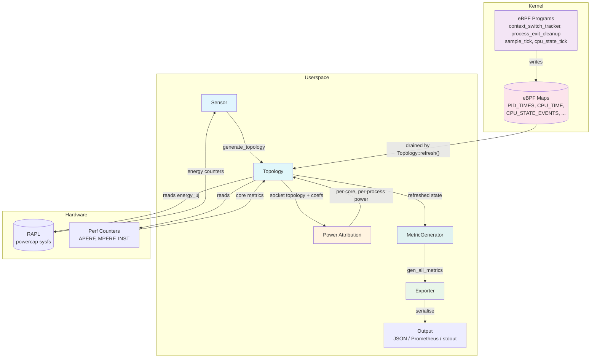
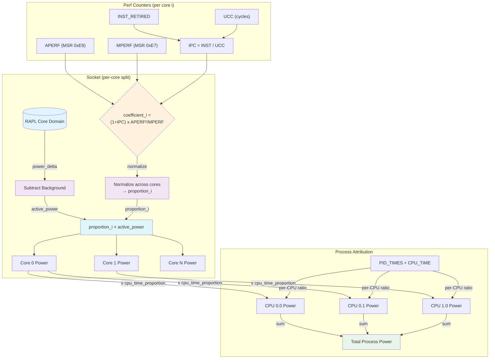
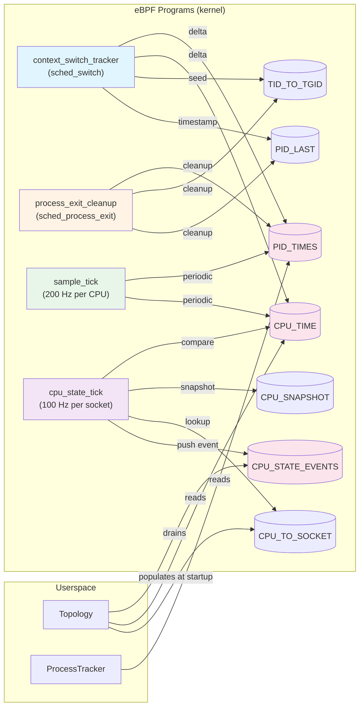
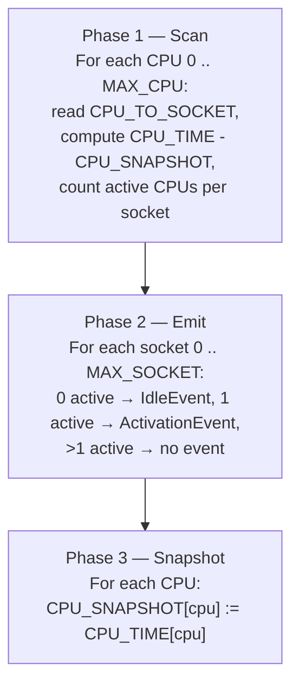

# Architecture

## Introduction

This chapter describes the architecture of the power attribution solution built on top of Scaphandre. The goal is to provide a high-level understanding of how the system is organised, how data flows through its components, and how the core attribution mechanism works.

The scope of this work is limited to CPU power attribution. Memory (DRAM) attribution is excluded due to the complexity of modelling DRAM energy behaviour, as discussed in the METRION paper, as well as the limited scope of this Master's thesis.

## Architecture Overview

The system is organised into four main components:

- **Sensor** — responsible for discovering hardware topology and reading energy measurement counters from the RAPL interface.
- **eBPF** — a kernel-level instrumentation layer that provides fine-grained per-process CPU time tracking and real-time idle/activation detection.
- **Power Attribution** — the core logic that transforms raw RAPL energy readings into per-process power estimates using hardware performance counters and eBPF data.
- **Exporter** — responsible for consuming the attributed power data and emitting it through configurable output channels.

These four components are coordinated through a central `Topology` structure that represents the hardware hierarchy — sockets, domains, cores — and is wrapped by a `MetricGenerator` that drives the periodic measurement cycle.



## Sensor Layer

The sensor is responsible for discovering the hardware topology and providing access to energy measurement counters. It scans system interfaces — primarily the `powercap` sysfs hierarchy at `/sys/class/powercap/` and performance counters via `perf_event_open` — to enumerate CPU sockets, their RAPL domains (core, package, DRAM, PSYS), and the logical cores belonging to each socket.

The `PowercapRAPLSensor` is the primary implementation on Linux. It detects the `intel_rapl` kernel module, discovers domain folders under the powercap hierarchy, and optionally supports MMIO-based RAPL access on newer platforms where the `intel_rapl_mmio` driver is used. The resulting `Topology` structure serves as the central representation of the system that both the power attribution logic and exporters operate on.

The sensor layer exposes several trait interfaces for extensibility:

- **`Sensor` trait** — requires `get_topology()` and `generate_topology()` to create and retrieve the hardware topology.
- **`RecordGenerator` trait** — implemented by `Topology`, `CPUSocket`, and `Domain`, provides `refresh_record()`, `get_records_passive()`, and `clean_old_records()` for periodic energy counter updates.
- **`RecordReader` trait** — implemented per-component, offers `read_record()` for direct counter reads.
- **`MultiValuedRecordGenerator`** and **`MultiValuedRecordReader`** — implemented by `CPUCore`, for reading richer per-core metrics including APERF, MPERF, and instruction counts.

## Power Attribution

The power attribution model aims to address three hardware effects that the original Scaphandre model was blind to: frequency scaling (DVFS), simultaneous multithreading (SMT), and contention between workloads running on the same core. It does so while keeping a low overhead profile.

### Core-level attribution

The model attributes power measured via RAPL first to cores, then distributes core power among processes based on utilisation. Since the focus is on CPU power, the implementation moves away from total host power to the Core RAPL domain, falling back to the Package domain when the Core domain is unavailable.

After reading the input power, background power is subtracted. Background power is defined as `max(idle, activation)`. In the ideal case activation power ≥ idle power, since activation power is composed of idle power plus the additional overhead of bringing cores out of C-states; under this condition the max selects activation. During convergence, or when activation has not yet been estimated and is reported as 0 — an estimation failure mode — the max falls through to idle, which then acts as a conservative fallback. The remaining active power is attributed to cores using a coefficient that captures both how fast and how effectively each core is working:

```
coefficient_i = (1 + IPC_i) * APERF_i * (APERF_i / MPERF_i)
```

The terms in this formula come from hardware performance counters:

- **MPERF** (Maximum Performance Register) — increments at the base (nominal) frequency while the core is in C0.
- **APERF** (Actual Performance Register) — increments at the actual running frequency while the core is in C0, factoring in thermal effects and throttling. The ratio `APERF / MPERF` is a standard Intel-recommended metric that mediates how fast the core is running relative to its nominal frequency.
- **UCC** (Unhalted Core Cycles) — a PMU counter that increments at the core's actual clock rate while in C0. It is not used in our coefficient but is needed to compute IPC.
- **IPC** (Instructions Per Cycle) — computed as `INST_RETIRED / UCC`, mediates how much effective work the core is doing in terms of instructions retired per cycle.

The choice of this combination is motivated by several considerations.

**How IPC handles SMT.** Under Simultaneous Multithreading, two hardware threads share the execution units of a physical core. Each thread's instruction throughput is reduced due to contention on shared resources (caches, execution ports, dispatch bandwidth). IPC naturally captures this: a thread running in isolation has all execution units to itself and achieves a higher IPC; the same thread sharing the core via SMT sees its instruction throughput drop, lowering its IPC, and consequently its attributed coefficient. This provides a principled way to distinguish parallel execution from isolated execution without hard-coded SMT penalties.

**Handling DVFS, contention, and C-states.** Our formula builds on the approach proposed by METRION, which already addressed these effects through the `UCC * APERF / MPERF` coefficient. We improve upon it by replacing UCC with APERF. The `APERF / MPERF` ratio captures how fast the core is running relative to its nominal frequency, factoring in DVFS transitions, thermal throttling, and turbo boost. Multiplying by APERF itself provides a measure of how long the core was active. Using APERF instead of UCC avoids PMU multiplexing errors — UCC is a hardware performance counter subject to multiplexing when more events are requested than physical registers, while APERF is a dedicated Model-Specific Register that runs continuously. APERF also reflects effects that UCC does not, such as thermal state and voltage fluctuations, making it a more accurate proxy for the core's actual performance state.

The `(1 + IPC)` term then ensures that a stalled core (IPC ≈ 0) still receives a non-zero coefficient, since it is consuming power even if not retiring instructions. This combination removes METRION's need for machine-specific hard-coded constants by using the more hardware-grounded IPC value instead.

The coefficients are normalised into proportions summing to 1.0 across all cores on a socket:

```
proportion_i = coefficient_i / sum(coefficient_j for all cores j)
```

Active socket power is then distributed to each core:

```
core_power_i = proportion_i * socket_active_power
```

### Process-level attribution

For process-level attribution, the eBPF subsystem provides per-process per-CPU busy time via the `PID_TIMES` map. For each process, the per-CPU busy time is read together with the total per-CPU busy time from the `CPU_TIME` map. For each logical CPU, a proportion is computed:

```
cpu_proportion_i = process_time_i / total_time_i
```

The process power contribution from a core is:

```
process_core_power_i = core_power_i * cpu_proportion_i
```

Total process power is the sum across all cores. When eBPF data is unavailable, the system falls back to OS-reported CPU time percentages from `/proc/stat`.

### Implementation Details

**Domain selection.** The implementation targets the Core RAPL domain (`intel-rapl:X:0` with name `"core"`) which reports combined CPU core power for the socket. When the Core domain is unavailable — for example on older AMD platforms — the implementation falls back to the Package domain. This is done per-socket, so heterogeneous configurations are handled correctly.

**RAPL wraparound.** On Linux (via the `powercap` sysfs interface), RAPL energy counters are exposed as 64-bit microjoule accumulators that wrap around when they overflow. The implementation detects wraparound by checking whether the later reading is smaller than the previous one. When no wraparound occurs, a direct subtraction `last - previous` gives the delta. When wraparound is detected, the delta is computed as `rapl_max_uj - previous + last`, with both operations using saturating arithmetic as a safety net.

**Perf counter multiplexing.** Instruction counts and CPU cycle counts are read via `perf_event_open`, which multiplexes hardware performance counters when more events are requested than physical PMU registers. The implementation scales each counter's raw count by `time_enabled / time_running` to correct for the fraction of the interval the counter was actually scheduled on hardware.

### Caveats

While the current approach does not reach the granularity of METRION, the simpler model was chosen deliberately. Since frequency shifts, SMT, contention, and C-state effects originate at the CPU core level, reasoning about attribution at this level is easier to validate and improve. In the current validation setup, processes run in near-isolation with minimal noise on their assigned core, meaning process power closely approximates core power. This allows validating the core-level attribution directly while establishing a foundation that can be extended to finer-grained process-level attribution in the future.



## eBPF Subsystem

The eBPF subsystem addresses a fundamental limitation of the Linux kernel: while `/proc/stat` reports general per-process CPU time, it does not provide per-CPU time for each process. Without this information, attributing a core's power to the processes that ran on it requires proportional division by total process runtime, which is unfair when processes migrate between cores or share a core via SMT.

The eBPF instrumentation provides two capabilities: per-process per-CPU time tracking, and real-time socket-level idle and activation power detection.

### Programs

Four eBPF programs run in the kernel:

1. **`context_switch_tracker`** — attached to the `sched/sched_switch` tracepoint. Fires on every context switch. Computes the time delta for the process being switched off, accumulates it into `PID_TIMES` and `CPU_TIME`, seeds the `TID_TO_TGID` mapping for the incoming process, and records the current timestamp.

2. **`process_exit_cleanup`** — attached to the `sched/sched_process_exit` tracepoint. Fires when a process exits. Finalises the last time delta, removes the TID-to-TGID mapping, and when the thread group exits (group_dead), removes the process entries from `PID_TIMES` and `PID_LAST` to free map space and prevent stale PID reuse errors.

3. **`sample_tick`** — a per-CPU timer program firing at 200 Hz (every 5ms). Acts as a backup for the sched_switch tracer: if a process runs for a long time without being context-switched, the periodic tick accumulates its time delta, updates `PID_TIMES` and `CPU_TIME`, and refreshes the process's entry in `PID_LAST` to the current timestamp.

4. **`cpu_state_tick`** — a per-socket timer program attached to one CPU per socket, firing at 100 Hz (every 10ms). Detects idle and activation states by comparing `CPU_TIME` against `CPU_SNAPSHOT` for every CPU on the socket, and pushes `IdleEvent` or `ActivationEvent` structs to the `CPU_STATE_EVENTS` ring buffer.

### Maps

The eBPF subsystem uses seven maps:

| Map | Type | Key | Value | Purpose |
|-----|------|-----|-------|---------|
| `PID_TIMES` | PerCpuHashMap | `u32` (TGID) | `u64` (ns) | Per-process per-CPU accumulated busy time |
| `PID_LAST` | PerCpuHashMap | `u32` (TGID) | `u64` (timestamp) | Last switch-in timestamp for delta computation |
| `TID_TO_TGID` | HashMap | `u32` (TID) | `u32` (TGID) | Thread-to-process group mapping |
| `CPU_TIME` | Array | `u32` (CPU index) | `u64` (ns) | Per-logical-CPU accumulated busy time |
| `CPU_SNAPSHOT` | Array | `u32` (CPU index) | `u64` (ns) | Snapshot of `CPU_TIME` for delta computation |
| `CPU_STATE_EVENTS` | RingBuf | — | `CpuStateEvent` | Socket idle/activation events to userspace |
| `CPU_TO_SOCKET` | Array | `u32` (CPU index) | `u16` (socket ID + 1) | CPU-to-physical-socket mapping |



### Idle and Activation Power Detection

The idle/activation detection system is organised per socket. At startup, the userspace code populates the `CPU_TO_SOCKET` eBPF array by reading `physical_package_id` from `/sys/devices/system/cpu/*/topology/physical_package_id` for each online CPU.

The `cpu_state_tick` program is attached to only one CPU per socket — the first logical CPU of each package. When it fires (every 10ms), it iterates CPUs from index 0 up to `MAX_CPU` (256), reading `CPU_TO_SOCKET` for each. Userspace populates the map with `socket_id + 1`, so a zero entry signals that no more CPUs exist and iteration stops. For each CPU it finds a socket mapping for, it compares `CPU_TIME` against `CPU_SNAPSHOT` to detect activity. For each socket, if zero CPUs had non-zero deltas, the entire socket is considered idle and an `IdleEvent` is pushed; if exactly one CPU was active, an `ActivationEvent` is pushed.

On the userspace side, `Topology::refresh()` drains the `CPU_STATE_EVENTS` ring buffer, groups the events by socket ID, and passes them to each `CPUSocket`'s `refresh_activation_idle_records()` method. The socket records the current host power reading alongside the event type, maintaining running minimums for both idle and activation power.

The power subtracted from the raw RAPL measurement — called background power — is the maximum of the estimated activation power and idle power. This is because activation power inherently includes the idle power of the active socket, so it should converge to a value at least as high as idle power. Taking the maximum between the two provides a conservative baseline that guards against the unlikely case where activation power has not yet converged to its true value.



### Failure Mode Handling

eBPF maps have a natural size limit. When the system is under high load with many short-lived processes, the maps could fill up with stale entries. This is handled by the `process_exit_cleanup` program, which on every `sched_process_exit` event finalises the last time delta for the exiting thread and removes its entry from `TID_TO_TGID`. When `group_dead` is set (the last thread in the process group), it additionally removes the process entries from `PID_TIMES` and `PID_LAST`. This also prevents a subtle error: Linux reassigns recycled PIDs, and without cleanup a new process could inherit stale accumulated time from an old one.

## Exporter Layer

Each exporter implements the `Exporter` trait with two methods: `run()` — the main measurement loop, and `kind()` — a string identifier (e.g. "stdout", "prometheus").

Exporters do not interact with sensors or eBPF directly. Instead, each exporter holds a `MetricGenerator` that wraps the shared `Topology`. In its `run()` loop, the exporter drives the measurement cycle:

1. `topology.refresh()` — advances one measurement cycle: drains eBPF ring buffer events, reads RAPL energy counters from sysfs (or MSR), polls `/proc/stat` for per-core stats, refreshes process tracking data, reads the eBPF `CPU_TIME` map, and computes per-core and per-process power attribution.
2. `metric_generator.gen_all_metrics()` — calls the various metric generation methods (`gen_self_metrics`, `gen_host_metrics`, `gen_socket_metrics`, `gen_system_metrics`, `gen_process_metrics`) to transform the refreshed `Topology` state into a flat vector of `Metric` structs.
3. `pop_metrics()` — drains the generated metrics for emission.
4. The exporter serialises these metrics to its output format and sleeps until the next cycle (typically every 1–2 seconds).

The `Exporter` trait allows new output formats to be added without modifying the sensor, eBPF, or attribution components. Existing implementations include stdout, JSON, Prometheus, Prometheus Push, QEMU, Riemann, and Warp10. Of these, JSON, Prometheus Push, Riemann, and Warp10 are feature-gated in the crate's `Cargo.toml` and are only compiled when the corresponding feature is enabled; stdout and Prometheus are always available.

## Data Flow Summary

The complete data flow through the system can be summarised as:

```
Hardware (RAPL, PMU counters)
    ↓ reads
Sensor → builds Topology (sockets → domains → cores)
    ↓
Topology::refresh() [called each cycle]
    ├── drain eBPF CPU_STATE_EVENTS (idle/activation detection)
    ├── read RAPL energy counters (RecordReader)
    ├── read /proc/stat per-core stats
    ├── read eBPF PID_TIMES, CPU_TIME maps
    ├── compute per-core power (attribution formula)
    └── compute per-process power (CPU-time proportions)
    ↓
MetricGenerator::gen_all_metrics()
    ↓
Exporter → serialise and emit
```

## Future Perspectives

- The current model uses per-CPU time to attribute CPU power to processes proportionally. A natural improvement would be to incorporate actual work done by the process — such as instruction counts or LLC misses — for finer-grained attribution.
- The idle and activation power estimation could be refined to converge faster and handle edge cases where the socket-level detection is insufficient.
- Extending the approach to cover DRAM power attribution remains an open direction that would require modelling memory controller activity and NUMA effects.

## Diagrams

| Name | Path |
|------|------|
| Contribution Architecture Overview | ./diagrams/contribution_architecture.png |
| Contribution Data Flow | ./diagrams/contribution_data_flow.png |
| Contribution eBPF Programs and Maps | ./diagrams/contribution_ebpf.png |
| Contribution Idle/Activation Detection | ./diagrams/contribution_idle_activation.png |
| Contribution Power Attribution Flow | ./diagrams/contribution_power_attribution.png |

## Notes

- **Riemann exporter uses the legacy attribution model.** `scaphandre/src/exporters/riemann.rs:236` calls `get_process_power_consumption_microwatts` (`scaphandre/src/sensors/mod.rs:1057`), which uses the old Scaphandre formula (`total_power × process_cpu_percentage / 100`) and bypasses the per-core/per-CPU attribution work. Every other exporter goes through `get_all_per_process` (`scaphandre/src/sensors/mod.rs:1156`), which applies the new per-core attribution. Riemann process-power numbers will diverge from the rest. Needs fixing later.
- **Source-tree filename typo.** `scaphandre/src/exporters/warpten.rs` is the file backing the `Warp10Exporter`; the filename should be `warp10.rs`. Source-tree issue, not a doc flaw — noted for awareness.
- **Graphviz orthogonal-spline warning.** Four scripts use `splines="ortho"`, which does not render edge labels cleanly (Graphviz emits a warning and may drop labels on some edges). For print quality, consider switching to `splines="polyline"` (already used by `contribution_architecture.py`). Cosmetic; defer until final figure polish.
